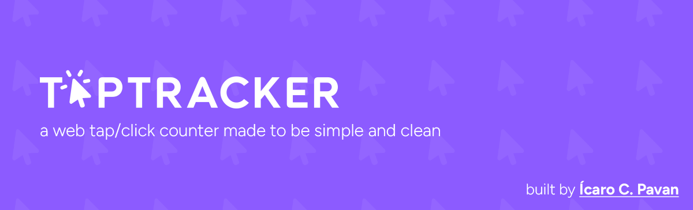
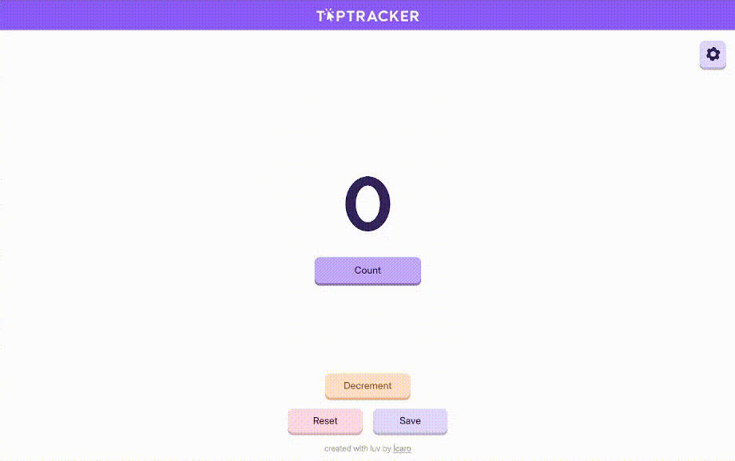

# Taptracker

Taptracker is a web-based tap counter application. With a modern and simple layout, it can be used for any purpose. Just tap (or click) and enjoy!

This project was built by **Ícaro C. Pavan**. If you enjoyed it, feel free to check out my other projects and consider giving this repo a ⭐! Thank you!

## 📦 Latest Version

**Current Release:** v1.0.0 — *2025-08-11*  

### What's New
- Official app launch with core features.

🔗 **Full Changelog:** [View all changes](CHANGELOG.md)

## 🚀 Deploy

Taptracker is currently deployoed on Github Pages. You access it by clicking [here](https://icaropvn.github.io/taptracker/)!

<div style="text-align: center;">
    
</div>

## ✨ Features

- Counter with input by button or screen tap.
- Decrement and reset options.
- Browser saving (LocalStorage persistence).
- Responsive design.
- Light and dark themes.
- Many settings customization.


## 🛠️ Built With

- [HTML5](https://developer.mozilla.org/en-US/docs/Web/Guide/HTML/HTML5)
- [CSS3](https://developer.mozilla.org/en-US/docs/Web/CSS)
- [JavaScript](https://developer.mozilla.org/en-US/docs/Web/JavaScript)

## 📂 Folder Structure

```
src/
 ├── assets/            # Images files
 ├── css/               # CSS files
 ├── fonts/             # Fonts files
 ├── js/                # JavaScript code
 ├── readme-assets/     # Readme static files
 ├── sounds/            # Sound effects files
 ├── CHANGELOG.md       # Changelog file
 ├── favicon.ico        # Favicon
 ├── index.html         # Main HTML file
 ├── LICENSE            # License file
 └── README.md          # Readme file
```

## 📄 License

This project is licensed under the MIT License.
